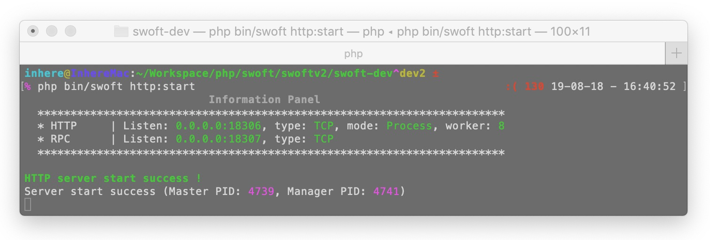

<p align="center">
    <a href="https://github.com/swoft-cloud/swoft" target="_blank">
        
    </a>
</p>

[](https://packagist.org/packages/swoft/swoft)
[](https://travis-ci.org/swoft-cloud/swoft)
[](https://hub.docker.com/r/swoft/alphp/)
[](https://secure.php.net/)
[](https://github.com/swoole/swoole-src)
[](https://www.swoft.org/docs)
[](https://github.com/swoft-cloud/swoft/blob/master/LICENSE)



Swoft is a PHP microservices coroutine framework based on the Swoole extension. Like Go, Swoft has a built-in coroutine web server and a common coroutine client and is resident in memory, independent of traditional PHP-FPM. There are similar Go language operations, similar to the Spring Cloud framework flexible annotations, powerful global dependency injection container, comprehensive service governance, flexible and powerful AOP, standard PSR specification implementation and so on.

Through three years of accumulation and direction exploration, Swoft has made Swoft the Spring Cloud in the PHP world, which is the best choice for PHP's high-performance framework and microservices management.

> **[中文说明](README.zh-CN.md)**

## Feature

- Built-in high performance network server(Http/Websocket/RPC)
- Flexible componentization
- Flexible annotation function
- Diversified command terminal(Console)
- Powerful Aspect Oriented Programming（AOP）
- Perfect Container management、Dependency Injection (DI)
- Flexible event mechanism
- Implementation of HTTP message based on PSR-7
- Event Manager Based on PSR-14
- Middleware based on PSR-15
- Internationalization(i18n) support
- Simple and efficient parameter validator
- High performance connection pool(Mysql/Redis/RPC)，Automatic reconnection 
- Database is highly compatible Laravel
- Cache Redis highly compatible Laravel
- Efficient task processing
- Flexible exception handling
- Powerful log system

## Document

- [中文文档](https://www.swoft.org/docs/2.x/zh-CN/README.html)
- [English](https://en.swoft.org/docs)

## Discuss

- [swoft-cloud/community](https://gitter.im/swoft-cloud/community)
- QQ Group1: 548173319      
- QQ Group2: 778656850

## Requirement

- [PHP 7.1+](https://github.com/php/php-src/releases)
- [Swoole 4.3.4+](https://github.com/swoole/swoole-src/releases)
- [Composer](https://getcomposer.org/)

## Install

### Composer

```bash
composer create-project swoft/swoft swoft
```

## Start

- Http server

```bash
[root@swoft swoft]# php bin/swoft http:start
```

- WebSocket server

```bash
[root@swoft swoft]# php bin/swoft ws:start
```

- RPC server

```bash
[root@swoft swoft]# php bin/swoft rpc:start
```

## License

Swoft is an open-source software licensed under the [LICENSE](LICENSE)
