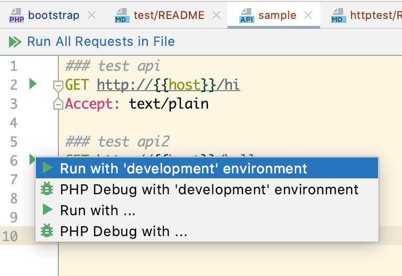

# Tests

## API tests

**If you want to run api tests, you must start the http server.**

tests case dir: `/test/api/`

## Start server

```bash
php bin/swoft http:start
# OR
php bin/swoft http:start -d
```

### Run api tests

```bash
php test/run.php -c phpunit.xml --testsuite apiTests
```

## Unit tests

tests case dir: `/test/unit/`

### Run unit tests

```bash
php test/run.php -c phpunit.xml --testsuite unitTests
```

## Http tests

tests case dir: `/test/httptest/`

**If you want to run http client tests, you must start the http server.**

### Run http tests

Can only be run inside phpstorm.


